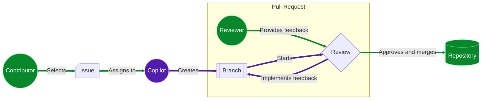

## Step 1: Enable Copilot coding agent

In the [Getting Started with GitHub Copilot](/skills/getting-started-with-github-copilot) exercise, we learned how to use Copilot in our code editor to make major upgrades to the Mergington Extracurricular Activities site. 🎻 ⚽️ ♟️

In fact, the site has become a regular school tool now. And, although you like that attention, you just realized a problem! You are about to go on sabbatical next semester!

After some discussion with the principal, he has accepted that new features will be postponed, but... he is worried. They need to at least have _something_ for handling simple changes while you are away.

Let's set our teachers up for success by enrolling Copilot (in our school) to handle updates while we are away.

<details>
<summary>📸 Website screenshot</summary><br/>


</details>

### 📖 Theory: Copilot is now your coding agent

In previous exercises, we used Copilot **chat**, **edits** and **agent** mode. While those were super helpful, **Copilot coding agent** takes this to the next level by operating entirely on GitHub. No code editor required! 😎

| Feature           | Copilot in the editor         | Copilot coding agent     |
| ----------------- | ----------------------------- | ------------------------ |
| **Interface**     | Your code editor              | Issues and Pull Requests |
| **Work Scope**    | Local files                   | Repository               |
| **Activation**    | Inline code suggestions, chat | Issue assignment         |
| **Customization** | Custom instructions           | Custom instructions      |
| **MCP Support**   | Yes                           | Yes                      |
| **Vibe Coding**   | 😎                            | 😎                       |

#### How does it work?

From the contributor perspective, the flow is very similar to a normal workflow.

1. A contributor with **write access** selects an issue and assigns it to Copilot (instead of themselves).
2. Copilot creates a branch and pull request.
3. Copilot works on the branch in an Actions workflow and provides updates via the pull request conversation tab.
4. When Copilot finishes the issue, the assigner is requested to review.
5. Assigner submits a review, adds comments, or approves.
6. If feedback is provided, Copilot continues working to implement it.
7. The requester repeats above steps until satisfied and then merges.



#### Is this safe?

Several security precautions have been implemented to help reduce concerns. Here are a few limitations that you might need to consider when asking Copilot to work on an issue.

- Copilot can only make changes on the branch it created and resources provided by the repository.
- Copilot has [configurable firewall](https://docs.github.com/en/enterprise-cloud@latest/early-access/copilot/coding-agent/customizing-copilot-coding-agents-development-environment#customizing-or-disabling-the-agents-firewall) that restricts access to the internet.
- Only users with write access can assign Copilot an issue.
- Hidden content in issues (like commented code) is ignored.

> [!IMPORTANT]
> The full list of mitigations and configuration settings can be found in the [Risks & Mitigations](https://docs.github.com/en/enterprise-cloud@latest/early-access/copilot/coding-agent/using-copilot-coding-agent#copilot-coding-agent-risks-and-mitigations) documentation.

## ⌨️ Activity: (optional) Get to know our extracurricular activities site

> [!NOTE]
> Opening a development environment and running the application is not necessary to complete this exercise. You can skip this activity if desired.

<details>
<summary>Show Steps</summary>

In other exercises, we have been developing the Extracurricular Activities website. You can follow these steps to start up the development environment and try it out.

1. Right-click the below button to open the **Create Codespace** page in a new tab. Use the default configuration.

   [](https://codespaces.new/{{full_repo_name}}?quickstart=1)

1. Wait some time for the environment to be prepared. It will automatically install all requirements and services.

1. Validate the **GitHub Copilot** and **Python** extensions are installed and enabled.

   <br/>
   

1. Try running the the application. In the left sidebar, select the **Run and Debug** tab and then press the **Start Debugging** icon.

   <details>
   <summary>📸 Show screenshot</summary><br/>

   

   </details>

   <details>
   <summary>🤷 Having trouble?</summary><br/>

   If the **Run and Debug** area is empty, try reloading VS Code: Open the command palette (`Ctrl`+`Shift`+`P`) and search for `Developer: Reload Window`.

   

   </details>

1. Use the **Ports** tab to find the webpage address, open it, and verify it is running.

   <details>
   <summary>📸 Show screenshot</summary><br/>

   

   </details>

</details>

## ⌨️ Activity: Enable Copilot coding agent on your repository

Before we can start delegating requests from the teachers to Copilot, we need to grant access to our repository.

1. In the top right, click your **user icon** and select **Settings**.

   <br/>
   

1. In the left navigation, expand the **Copilot** section and select **Coding agent**.

   

1. Check that the **Repository access** field is set to `All repositories`.

   Alternatively, if you prefer to enable it only for this exercise, select `Only selected repositories` and select this exercise repository (`{{ full_repo_name }}`).


   

## ⌨️ Activity: Assign Copilot an issue

There are several important issues to get done before we leave, but let's do a test run on one of the simple options first. This will let us see how interactions and collaboration work, so we can update our docs for guiding the other teachers. Most don't know how to use a traditional coding editor!

> [!TIP]
> Try to make an issue's goal and acceptance criteria clear. Also, breaking down large tasks into shorter ones provides more opportunity for feedback!

1. Go to the **Issues** tab of this exercise repository and click the **New Issue** button.

1. Set the **Title** to:

   ```md
   Missing Activity: Manga Maniacs
   ```

   Enter the below text as description, and click the **Create** button.

   ```md
   The manga club was recently announced and is naturally missing from the website. Please add it.

   Here are the details:

   Description: Explore the fantastic stories of the most interesting characters from Japanese Manga (graphic novels).

   Schedule: Tuesdays at 7pm
   Max attendance: 15 people
   ```

1. In the top right, click on the **Assignees** area and select **Copilot**.

   

1. As you assign the issue to Copilot - after a moment, you will notice:

   - The issue will have an `👀` reaction to show Copilot is reading the issue.
   - The activity log shows you assigned the issue to Copilot.
   - The issue log includes a linked pull request.

   

1. With the issue assigned, Mona should be busy checking your work. Give her a moment to share the next steps.

<details>
   <summary>Having trouble? 🤷</summary><br/>

If you don't get feedback, here are some things to check:

- Make sure you assigned the correct issue. If you practice on other issues, they will be ignored.

</details>
