## Step 2: Collaborate with Copilot

Now that you've assigned Copilot to your Issue, you can see Copilot also started a Pull Request and linked it to your issue!

Let's learn how to review Copilot's work and provide feedback, just like you would with any team member.

### 📖 Theory: Understanding Copilot's collaboration workflow

Copilot provides transparency into its work through multiple channels on the pull request. Let's look into those!

#### 📝 Pull request description

The description will be continuously updated as Copilot progresses through its work. You can watch the description updates in real time!

#### 🤖 Coding Agent Sessions

Copilot does all work inside **sessions**. Each time you assign a task, it analyzes the problem, plans its approach, and implements changes. The first session is started immediately when Coding Agent gets assigned.

In the pull request timeline, you will be able to see progress indicators showing when Copilot starts and completes work

You can access the Coding Session logs in two ways:

- **🔴 Live**: Watch the logs in real-time to see all the steps and logic Copilot Coding Agent session is taking to solve the task
- **📋 Review**: View the session logs after Copilot has completed its work to review the decisions made

<details>
<summary>📸 Copilot Session Logs </summary><br/>


</details>


#### 💬 Providing feedback to Copilot

Once Copilot completes its work, you can collaborate with it just like any team member. The key to effective collaboration is understanding how to trigger new coding sessions:

Copilot will only act on comments or pull request reviews when they include a `@copilot` mention.

This means you can also leave regular comments for your other, human team members and Copilot won't start unnecessary sessions!

```mermaid
flowchart LR
    A[Leave PR Comment/Review] --> B{Contains @copilot?}
    B -->|Yes| C[🤖 New Coding Agent Session]
    B -->|No| D[💬 Regular Comment Only]
```



#### ⚙️ Important considerations

- Copilot's work is done on a branch with the convention `copilot/*` and does not have access to other branches
- Copilot cannot trigger Actions workflows. Workflows triggered on pull requests require human approval before running
- Rulesets and similar protections are still enforced

> [!TIP]
> All work created by Copilot is committed with the assignee as a co-contributor (keeping your contribution graph safe). 💕

### ⌨️ Activity: View Copilot's progress

1. Navigate to the **Pull Request** that Copilot referenced in your issue.

1. Watch in real-time as Copilot updates the pull request description. It will progress through 3 phases:

   <details>
      <summary>1. When starting, Copilot provides an initial copy of the issue. <b>[show image]</b></summary>
      
   </details>

   <details>
      <summary>2. After planning, Copilot provides a set of action items. <b>[show image]</b></summary>
      
   </details>

   <details>
      <summary>3. After finishing, Copilot provides a summary. <b>[show image]</b></summary>
      
   </details>

1. Scroll down slightly to view the timeline and high-level notes provided by Copilot. Click the **View session** button.

   

1. The new page shows a journal of Copilot's work. The left navigation is a list of each working session.

   

1. If the Copilot session is still ongoing, monitor the session journal.

1. When Copilot completes its work and requests you as a reviewer, you can proceed to the next activity!

> [!TIP]
> You can use the **edited** dropdown to view the pull request description change history.
>
> <details>
> <summary>Show image</summary>
> 
> </details>

### ⌨️ Activity: Provide Copilot feedback

Now that Copilot has finished its working session, let's review its work and provide some feedback!

1. In the pull request, click the **Add your review** button.

   

1. Find the new entry created by Copilot. Hover over a line to show the plus sign. **Click** to open the add comment dialog box.

   

1. Reading the description, we think it should be more interesting to match the Manga spirit. Let's ask Copilot to fix that. Enter the following text and click **Start a review**.

   ```md
   @copilot Please change this description to be inspired by Japanese Manga.
   It needs more personality to attract students.
   ```

1. At the top of the changes list, click the **Finish your review** button and select **Submit Review**.

1. After a moment, Copilot will add a new session entry and indicate progress on the timeline. Wait for Copilot to finish working on the change.

   > 🪧 **Note:** This can take some time! You can monitor the new session or take a break.

1. Once Copilot is finished, you will get requested as a reviewer again.

1. Activate the pull requests by clicking the **Ready to Review** button then click the **Merge** button.

1. With the pull request merged, Mona should be checking our work. Give her a moment to respond with the next lesson.

<details>
<summary>Having trouble? 🤷</summary><br/>

If you don't get feedback, here are some things to check:

- Make sure your reviews include `@copilot` mention
- To progress to the next step in this lab you need to merge the pull request!

</details>
